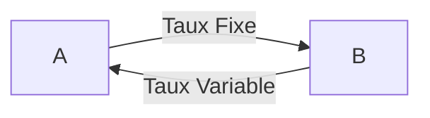
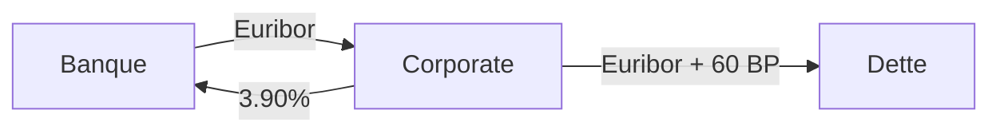
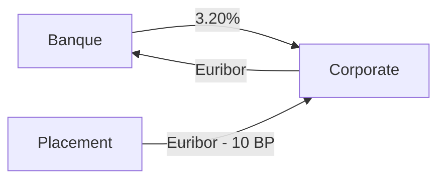

Un **swap de taux** (*Interest Rate Swap* \[IRS]) est un contrat dérivé ferme traité de gré à gré (OTC) entre deux contreparties.
A et B vont échanger pendant une période donnée des flux à taux fixe (*jambe fixe*) contre des flux variables indexés sur un taux type Euribor ou €STR (*jambe variable*).

## Les deux jambes d'un swap
Les deux jambes d'un swap sont **indépendantes** et n'ont pas forcément les mêmes caractéristiques.
A peut payer à B un taux fixe annuellement, contre un EURIBOR6M tous les 6 mois.
- **Jambe Fixe** : Taux fixe, fréquence et base de calcul des flux
- **Jambe Variable** : taux de référence, mode de fixing, fréquence et base de calcul des flux
Ici :
- **Point de vue de A** :
	- Je paie un taux fixe à **B**
	- Je suis engagé dans un **swap payeur** avec **B**
- **Point de vue de B** :
	- Je paie un taux variable à **A**
	- Je suis engagé dans un **swap receveur** avec **A**

## Pourquoi traiter un swap ?
- **Swap Payeur**
	- Anticiper une hausse des taux
	- Transformer une dette à taux variables en dette à taux fixe \[cash-flow hedge]
	- Couvrir un portefeuille dont la valeur ***baisse*** quand les taux **montent** (portefeuille obligataire)
- **Swap receveur**
	- Anticiper une baisse des taux
	- Transformer une dette à taux fixe en taux variables (*Euribor + marge*) \[fair value hedge]
	- Couvrir un portefeuille dont la valeur ***baisse*** quand les taux **baissent**
En résumé cela permet de : 
- Se hedged en Fair Value/Cash-flows
- Spéculer sur l'évolution future des taux d'intérêts
- Couvrir un risque de taux

## Exemples
### Exemple 1
Je suis endetté à taux variable EURIBOR + 60 BP sur 5 ans Le taux swap 5 ans cote 3,90%

La dette à taux variable (Euribor + 60BP) est transformée en dette à taux fixe (4.50% = 3.90%+60BP).

### Exemple 2
J'ai un placement sur 3 ans à taux variable EURIBOR - 10 BP.
Le taux swap 3ans côté à 3.20%

Le placement a taux variable (Euribor - 10BP) se transforme en placement à taux fixe (3.10% = 3.20% - 10BP)

## Flux d'un swap de taux standard
***Sur l'Euro, le standard est Fixe Annuel 30/360 vs. EURIBOR6M***
![[Pasted image 20251201095639.png]]
Dans un swap standard :
- **Pas d'échange de cash au départ**, le taux fixe est tel que la transaction soit équitable
- Départ des échéanciers à **J+2**
- Flux payés en **fin** de chaque période d'intérêts
Les flux :
- **Flux de la jambe fixe** : $N * \delta_i^F * TauxFixe$
- **Flux de la jambre variable** : $N * \delta_j^V * Euribor_j$
	- L'$EURIBOR_j$ est fixé **2 jours ouvrés avant le début** de la période d'intérêt
## Qu'est-ce que le taux swap ?
C'est le taux fixe qui rend le swap ***"équitable"***
Autrement dit $PV_{JambeFixe} = PV_{JambeVariable}$
Les swaps de taux sont côtés en taux swap.

**NB** : Au moment où on traite un swap dans le marché :
- Taux fixe = Taux swap sur le marché
## Cotation des swaps
![[Pasted image 20251201102036.png]]

## Point de vue du Market Maker
Le rôle du *market maker* (desk swap au sein de la banque) est d emettre face à face des intérêts opposés (en prenant sa marge correspondant à la fourchette bid-ask)![[Pasted image 20251201103911.png]]
Les intérêts n'étant pas systématiquement "exactement" opposés, il restera donc des risques résiduels à couvrir avec des futures et swaps auprès d'autres banques.

## La valeur d'un swap
- Swap payer 10ans 100M€ traité à 5.00%
- Une heure plus tard, la nouvelle fourchette est 5.05/5.09
Pour appréhender la valeur de notre **swap payeur**, imaginons entrer dans une position inverse avec les nouvelles conditions de marché :
- Swap payeur 5.00
- Swap receveur 5.05
- Les jambes variables s'annulent et on reçoit 0.05 fixe (jambe fixe 10ans)
Le swap s'évalue donc de la façon suivante :
$$\begin{aligned} PV_{Swap}^{P} &=  \sum_{i=1}^{10} 100M \texteuro * \delta _i * 0.05\% * DF(T_i) \\ &= (\sum_{i=1}^{10} 100M \texteuro * \delta _i) * (TauxSwap - TauxFixe) \end{aligned}$$

### Evaluation d'un swap : Jambe Fixe
La ***jambe fixe*** s'évalue par actualisation des flux (*voir schéma ci-dessus pour les flux*)
$$PV_{JambeFixe} = \sum_{i=1}^{n} N * \delta_i^F * TauxFixe * DF(T_i^F)$$
### Evaluation d'un swap : Jambe Variable
Pour la ***jambe variable***, nous ne connaissons pas les flux en avance (car ils sont fixés à J-2 de chaque période d'intérêt), nous utiliserons donc les **taux FRA**
$$\begin{aligned}PV_{JambeVariable} = \sum_{j=1}^{n} N * \delta_j^V * TauxFRA * DF(T_j^V) \\  avec \space TauxFRA_j \space le \space taux \space FRA \space  de \space la \space période \space d'intérêt \space (T_{j-1}^V,T_{j}^V)\end{aligned}$$Or on connait la relation entre taux FRA et DFs :
$$TauxFRA_j = \frac {1}{\delta_j^V}(\frac {DF(T_{j-1}^V)}{DF(T_{j}^V)}-1) = \frac {1}{\delta_j^V}(\frac {DF(T_{j-1}^V) - DF(T_{j}^V)}{DF(T_{j}^V)})$$
On obtient donc après remplacement et simplification :
$$\begin{aligned} PV_{JambeVariable} &= \sum_{j=1}^{m} N * (DF(T_{j-1}^V) - DF(T_{j}^V)) \\ &= N * (DF(T_{0}^V) - DF(T_{m}^V)) \\ & \approx N * (1 - DF(T_{m}^V))\end{aligned}$$
**Remarque** : 
On pouvait évaluer la jambe variable directement sans utiliser les FRAs. 
Il suffit pour cela d’imaginer que l’on place le nominal du swap aux taux EURIBOR successifs…
![[Pasted image 20251201132145.png]]
### Evaluation d'un swap : Résumé
L'expression obtenue pour la PV de la jambe variable ne fait intervenir que les DFs correspondant aux dates de début et de fin du swap. 
L'échéancier n'intervient donc plus.
Seul l'échéancier de la jambe fixe interviendra donc.
**Mais ce n'est pas réaliste !!!**

### Limites du cadre "Single Curve"
Ce n'est plus réaliste depuis 2008 et la crise du crédit, le spread de crédit est apparu.
Car :
- Avant 2008 : ==Hypothèse : aucun risque de crédit majeur sur le marché interbancaire ⇒ les taux IBOR servaient à tout.==
	- On utilisait donc une seule courbe pour :
		1. Actualiser les flux (Courbe de discounting)
		2. Pour projeter les taux (Courbe de Forwarding)
- Après 2008 : ==Les marchés on reconnu ce risque de crédit==
	- On utilise donc deux courbes pour :
		1. Actualiser les flux (Courbe de discounting) \[OIS (Overnight Index Swap)]
		2. Pour projeter les taux (Courbe de Forwarding) \[IBOR (EURIBOR3M, 6M...)]

La formule de calcul en multi-curve reste donc la même, à la seule différence que le calcul du DF et celui du TauxFRA/TauxFixe sont basés respectivement sur l'OIS et la courbe IBOR.![[Pasted image 20251202095948.png]]

## Swaps EONIA (OIS)
**OIS** : Overnight Index Swap (fondé sur EONIA/€STR)
Différence notable avec un swap Euribor :
- Le taux variable est capitalisé sur la période d'intérêt
![[Pasted image 20251202100916.png]]
## Expression du taux swap
On calcule le taux swap par égalisation des deux jambes et on obtient $$Taux Swap = \frac {\sum_{j=1}^{m} \delta_j^V*TauxFRA*DF(T_j^V)}{\sum_{i=1}^{n} \delta_i^F*DF(T_i^F)}$$
Dans le cas du **single curve** :
- Seul l'échéancier de la jambe fixe intervient comme vu précédemment
- On a donc $$Taux Swap = \frac {DF(T_0)-DF(T_n)}{\sum_{i=1}^{n} \delta_i^F*DF(T_i^F)}$$
## Valeur d'un Swap

**Swap Payeur :**
$$\begin{aligned} PV_{Swap}^P &= PV_{JambeVariable} - PV_{JambeFixe} \\
&=\sum_{j=1}^{m} N * \delta_j^V*TauxFRA*DF(T_j^V) - \sum_{i=1}^{n} N * \delta_i^F * TauxFixe * DF(T_i^F) \\
&= (N\sum_{i=1}^{n} \delta_i^F*DF(T_i^F)) * (\frac {\sum_{j=1}^{m} \delta_j^V*TauxFRA*DF(T_j^V)}{\sum_{i=1}^{n} \delta_i^F*DF(T_i^F)} - TauxFixe)\end{aligned}$$
Soit : $$PV_{Swap}^P = (N\sum_{i=1}^{n} \delta_i^F*DF(T_i^F)) * (TauxSwap - TauxFixe)$$

**Swap Receveur :**$$PV_{Swap}^P = PV_{JambeFixe} - PV_{JambeVariable}$$
Soit :
$$PV_{Swap}^P = (N\sum_{i=1}^{n} \delta_i^F*DF(T_i^F)) * (TauxFixe - TauxSwap)$$
## Convexité
![[Pasted image 20251202103641.png]]

## Exemple
**20 mai 2010** : je traite un **swap 10 ans payeur** au **taux swap 3.08%** Ce jour là, **EURIBOR6M = 0.99%** Mon swap a un carry fortement négatif : je suis structurellement perdant en cash-flows sur le début de mon swap.
Même si l’Euribor 6 mois monte à 2%, je resterai très perdant ! Où puis-je gagner si les taux montent ?
![[Pasted image 20251202104150.png]]
## Swap vs Obligation
Pour comprendre le lien Swap vs Obligation, on rappelle que la $PV_{JambeVariable} = N * (DF(T_0)-DF(T_n))$
Une jambe variable se résume donc à un flux $+100$ en $T_0$ et $-100$ en $T_n$
**Un swap receveur nominal 100 et taux fixe x% consiste à** :
- Recevoir le taux fixe x% à la fin de chaque période
- Payer la jambe variable, ce qui est équivalent à payer 100 en T0 et recevoir 100 en $T_n$
![[Pasted image 20251202114239.png]]
==Si l'obligation est au pair, le swap vaut 0 (car le -100 correspondra au prix de l'obligation)==
**Conclusion :**
- Swap receveur x% = Obligation taux facial x% - 100 en $T_0$
- Obligation taux facial x% = Swap receveur x% +100 en $T_0$
En terme de sensibilité, les deux produits sont identiques dans la mesure où le flux en $T_0$ n'a pas de sensibilité ($T_0$ = J+2 $\approx$ Aujourd'hui)
