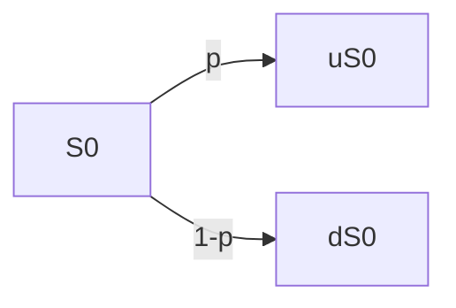

# Un première présentation
## Marché
- Placement sans risque au taux d'intérêt $r \gt 0$ connu/fixé
- Actif risqué de valeur  $S_0 \gt 0$ en $t = 0$ fixé et $S_1$ en $t = 1$ inconnue tel que$$S_1 = \begin{cases}
uS_0 \space avec \space probabilité \space p \in ]0,1[\\
dS_0 \space avec \space probabilité \space 1-p
\end{cases}$$où $0 \lt d \lt u$ fixé

## Hypothèse
On suppose que $d \lt 1+r \lt u$
==Pas d'arbitrage==
## Portefeuille
Partant d'une richesse initiale $x \in \mathbb R$, on achète/vend $(+ \space / \space -)\phi \in \mathbb R$ unités d'actif risqué en $t=0$  et on déboucle en $t=1$ $$\begin{aligned}
V_0 &= x \\
&= \phi S_0 + (x - \phi S_0) \\
&= Risqué+Sans \space risque\\
V1 &= \phi S_1 + (x - \phi S_0)(1+r)
\end{aligned}$$
## Option
On considère une option de payoff $g(S_1)$ et on cherche à construire un portefeuille de couverture, i.e., on veut trouver $x \in \mathbb R$ et $\phi \in \mathbb R$ tel que $$\begin{aligned}
&\phi S_1 + (x - \phi S_0)(1+r) = g(S_1) \\
\iff &\begin{cases}\phi uS_0 + (x - \phi S_0)(1+r)  = g(uS_0) \\ \phi dS_0 + (x - \phi S_0)(1+r)  = g(dS_0)\end{cases} \\
\iff &\begin{cases}\phi uS_0 - \phi dS_0 = g(uS_0) - g(dS_0) \\ (1+r)x - \phi(1+r-d) S_0 = g(dS_0)\end{cases}\\
\iff &\begin{cases}\phi = \frac {g(uS_0) - g(dS_0)}{uS_0 - dS_0} \\ x = \frac {1}{1+r}(g(dS_0) + \phi(1+r-d)S_0) &= \frac {1}{1+r}(g(dS_0) + \frac {g(uS_0) - g(dS_0)}{u\enclose{updiagonalstrike}{S_0} - d\enclose{updiagonalstrike}{S_0}}(1+r-d)\enclose{updiagonalstrike}{S_0}) \\ &= \frac {1}{1+r} [\frac {1+r-d}{u-d}g(uS_0)+(1-\frac {1+r-d}{u-d})g(dS_0)] \\&= \frac {1}{1+r}[q \space g(uS_0) +(1-q) \space g(dS_0)]\end{cases}
\end{aligned}$$ou $q=\frac {1+r-d}{u-d}$
## Conclusion
$x$ est le juste prix auquel on peut vendre l'option, on peut alors se couvrir en achetant $\phi$ unités d'actif risqué
## Remarque
On dit que le marché est complet car toutes les options sont réplicables
~={red}Ni $x$, ni $\phi$ ne dépendent de $p$ =~ 
# Notion de probabilités
## Espace de probabilités
- $\Omega = \{\omega_1, \omega_2, \omega_n\}$ ensemble fini
- $\mathcal F = \mathcal P(\Omega)$ \[*parties de Omega*] l'ensemble des évènements, appelé ***tribu***
- $\mathbb P$ mesure de probabilité, i.e., $\mathbb P : A \subset \Omega \longrightarrow \mathbb P(A) \in [0,1]$, tel que
	1. $\mathbb P(\Omega) = 1$
	2. $\mathbb P(A \cup B) = \mathbb P(A) + \mathbb P(B) \space si \space A \cap B = \emptyset$
La probabilité $\mathbb P$ est caractérisée par la donnée de $(\mathbb P(\omega))_{\omega \in \Omega}$ car $\mathbb P(A) = \sum_{\omega \in A} \mathbb P(\omega)$
*Exemple* : $\Omega = {\omega_1,\omega_2,\omega_3}$
$\mathcal P(\Omega) = \{\emptyset, \{\omega_1\}, \{\omega_2\},\{\omega_3\}, \{\omega_1, \omega_2\}, \{\omega_2, \omega_3\}, \{\omega_1, \omega_3\}, \Omega\}$
$\mathbb P(\omega_1) = \mathbb P(\omega_2) = \mathbb P(\omega_3) = \frac {1}{3}$
$\mathbb Q(\omega_1) = \frac 13, \mathbb Q(\omega_2) = \frac 23, \mathbb Q(\omega_3) = 0$
## Variable aléatoire
C'est une application $$X : \omega \in \Omega \longrightarrow X(\omega) \in \mathbb R(ou \space \mathbb R^d)$$
La loi de $X$ est la donnée de $$\mathbb P(X=x) \in [0,1], \forall x \in X(\Omega)$$
*Exemple* : On considère $$X(\omega) = \begin{cases} 0 \space &si \space \omega =\omega_1 \\ 1 \space &si \space \omega =\omega_2 \\ -1 \space &si \space \omega =\omega_3 \end{cases}$$
$$\left. \begin{matrix}
\mathbb P(X=0) = \mathbb P(\omega_1) = \frac 13 \\
\mathbb P(X=1) = \mathbb P(\omega_2) = \frac 13 \\
\mathbb P(X=-1) = \mathbb P(\omega_3) = \frac 13 
\end{matrix} \right| \implies X \sim \mathcal U(\{-1,0,1\}) \space sous \space \mathbb P$$
$$\left. \begin{matrix}
\mathbb Q(X=0) = \mathbb P(\omega_1) = \frac 13 \\
\mathbb Q(X=1) = \mathbb P(\omega_2) = \frac 23 \\
\mathbb Q(X=-1) = \mathbb P(\omega_3) = 0 
\end{matrix} \right| \implies X \sim Bernoulli(\frac 23) \space sous \space \mathbb Q$$
## Calcul d'espérance :
$$\mathbb E[X] = \sum_{\omega \in \Omega} X(\omega) \mathbb P(\omega) = \sum_{x \in X(\Omega)} x \mathbb P(X=x)$$
$$\mathbb E[f(X)] = \sum_{\omega \in \Omega} f(X(\omega)) \mathbb P(\omega) = \sum_{x \in X(\Omega)} f(x) \mathbb P(X=x)$$$\implies var(X) = \mathbb E[(X-\mathbb E[X])^2] = \mathbb E[X^2] - \mathbb E[X]^2$
*Exemple* : 
1. $X \sim Bernoulli(p)$ où $p \in [0,1]$, i.e., $\mathbb P(X=1) = 1 - \mathbb P(X=0) = p$
   On a :
   $\mathbb E[X] = 0 * \mathbb P(X=0) + 1 * \mathbb P(X=1) = p$ 
   $\mathbb E[X^2] = 0^2 * \mathbb P(X=0) + 1^2 * \mathbb P(X=1) = p$
   $var(X) = \mathbb E[X^2] - \mathbb E[X]^2 = p - p^2 = p(1-p)$
2. $X \sim \mathcal B(n,p)$ où $n \in \mathbb N^*, p \in [0,1]$, i.e. $\mathbb P(X=k) = \left( \begin{matrix}  n \\ k \end{matrix} \right) p^k (1-p)^{n-k}, \forall k \in \{1,...,n\}$  
   Puisque $X = \sum_{i=1}^n X_i$ où $(X_i)_{1 \le i \le n}$ indépendants et de même loi $Bernoulli(p)$, on a
   $\mathbb E[X] = \mathbb E \left[\sum_{i=1}^n X_i \right] \underset {car \space \mathbb E \space linéaire}{=} \sum_{i=1}^n \mathbb E[X_i] = np$ 
   $var(X) = var(\sum_{i=1}^n X_i) \underset {X \perp\!\!\!\perp Y}{=} \sum_{i=1}^n var(X_i) = np(1-p$)
## Tribu de X
C'est l'ensemble des évènements qui ne dépendent que de la réalisation de $X$, noté $\sigma (X)$
Une variable aléatoire (v.a.) $Y$ est $\sigma(X)-mesurable$ lorsque la valeur de $Y$ est connue si la valeur de $X$ est connue, i.e., $Y = f(X)$
# Le modèle revisité
## Espace de probabilité
- $\Omega = \{\omega_u, \omega_d\}$
- $\mathcal P(\Omega) = \{\emptyset, \{\omega_u\}, \{\omega_d\}, \Omega\}$
- $\mathbb P(\omega_u) = 1- \mathbb P(\omega_d) = p \in ]0,1[$
## Marché
- Taux sans risque $r \gt 0$ fixé
- Actif risqué : $S_0 \gt 0$ fixé et $S_1$ v.a. définie par : $$S_1(\omega) = \begin{cases} uS_0 \space si \space \omega = \omega_u \\ dS_o \space si \space \omega = \omega_d \end{cases}$$ où $0 \lt d \lt u$ fixés
## Portefeuille :
Étant donné $\begin{cases} x \in \mathbb R \space capital \space initial \\ \phi \in \mathbb R \space \ \space actif \space risqué \end{cases}$ on a :$$\begin{aligned}
&V_0^{x,\phi} = x = \phi S_0 + (x - \phi S_0) \\
&V_1^{x,\phi} = \phi S_1 + (x - \phi S_0)(1+r) &\space v.a.[\sigma(S_1)-mes]\\
ie \space &V_1^{x,\phi} = \phi S_1(\omega) + (x - \phi S_0)(1+r) &\forall \omega \in \Omega
\end{aligned}$$
## Arbitrage
C'est une stratégie $\phi \in \mathbb R$ tel que $$\begin{aligned}
&\mathbb P(V_1^{0,\phi} \ge 0) = 1 \space &et \space &\mathbb P(V_1^{0,\phi} \gt 0) \gt 0 \\
i.e. \space &\forall \omega \in \Omega, V_1^{0,\phi}(\omega) \ge 0 \space &et \space &\exists \omega \in \Omega,V_1^{0,\phi}(\omega) >0 
\end{aligned}$$
### Condition AOA (Absence d'Opportunité d'Arbitrage)
Il n'y a pas d'opportunité d'arbitrage, i.e., $$\forall \phi \in  \mathbb R , V_1^{0,\phi} \ge 0 \implies V_1^{0, \phi} = 0$$
==Il est clé de voir que x=0, et donc que la valeur du portefeuille en t=1 doit être nulle==
## Option
On souhaite construire un portefeuille de réplication pour l'option de payoff $g(S_1) \space [v.a.\sigma(S_1)-mes]$ ,i.e., on cherche $x \in \mathbb R$ et $\phi \in \mathbb R$ tel que $$\begin{aligned}
&\mathbb P(V_1^{x,\phi} = g(S_1)) = 1 \\
\iff & \forall \omega \in \Omega, V_1^{x, \phi}(\omega) = g(S_1(\omega)) \\
\iff & \begin {cases} V_1^{x,\phi}(\omega_u) = g(S_1(\omega_u)) \\ V_1^{x,\phi}(\omega_d) = g(S_1(\omega_d)) \end{cases} \\
.\\.\\&idem \space partie \space 1\\.\\.\\
\iff & \begin {cases} \phi = \frac {g(uS_0) - g(dS_0)}{uS_0 - dS_0} \\ x = \frac {1}{1+r}[q \space g(uS_0) + (1-q) \space g(dS_0)] \end{cases}
\end{aligned}$$
## Probabilité risque neutre
On définit une nouvelle probabilité $\mathbb Q$ sur $\Omega$ par $$\mathbb Q(\omega_u) = 1-\mathbb Q(\omega_d) = q = \frac {1+r-d}{r-d} \in ]0,1[$$
Alors le prix de réplication s'écrit $$\begin{aligned}
x &= \frac {1}{1+r}\left(q \space g(uS_0) + (1-q) \space g(dS_0)\right) \\&= \frac {g(S_1(\omega_u))}{1+r} \mathbb Q(\omega_u) + \frac {g(S_1(\omega_d))}{1+r} \mathbb Q(\omega_d) \\&= \mathbb E^{\mathbb Q} \left[\frac {g(S_1)}{1+r}\right]
\end{aligned}$$De plus, $$\begin{aligned}
\mathbb E^{\mathbb Q}[S_1] &= S_1(\omega_u) \mathbb Q(\omega_u) + S_1(\omega_d) \mathbb Q(\omega_d) \\
&= q \space uS_0 + (1-q) \space dS_0 \\
&= \frac {1+r-\enclose{updiagonalstrike}{d}}{u-d}uS_0 + \frac {\enclose{updiagonalstrike}{u}-(1+r)}{u-d}dS_0 \\
&= \frac {1+r}{\enclose{updiagonalstrike}{u}-\enclose{updiagonalstrike}{d}}(\enclose{updiagonalstrike}{u}S_0 - \enclose{updiagonalstrike}{d}S_0) \\
&= (1+r)S_0 \\
\iff &\mathbb E^{\mathbb Q}\left[\frac {S_1}{1+r}\right] = S_0
\end{aligned} 
$$
Ainsi les rendements des placements risqués et sans risques sont identiques (d'où ~={yellow}**risque neutre**=~)
Plus généralement, $$\begin{aligned}
\mathbb E^{\mathbb Q}[V_1^{x,\phi}] &= \mathbb E^{\mathbb Q} [\phi S_1 + (x - \phi S_0)(1+r)] \\
&= \phi \mathbb E^{\mathbb Q}[S_1] + (x-\phi S_0)(1+r) \\
&= \phi (1+r)S_0 + (x-\phi S_0)(1+r) \\
&= (1+r)x \\
&= (1+r) V_0^{x,\phi} \\
\iff &\mathbb E^{\mathbb Q}\left[\frac {V_1^{x,\phi}}{1+r}\right] = V_0^{x,\phi}
\end{aligned}$$
~={yellow}Les prix actualisés sont des martingales sous $\mathbb Q$ =~
## Conséquence
En utilisant $\mathbb Q$, on peut facilement montrer l'absence d'opportunité d'arbitrage, soit $\phi \in \mathbb R$ tel que $V_1^{0,\phi} \ge 0$, on observe :$$\begin{aligned}
\mathbb E^{\mathbb Q}[V_1^{0,\phi}] &= (1+r)V_0^{0, \phi} &= 0 \\
\implies&= \underset {\gt 0}{\mathbb Q(\omega_u) }\underset {\ge 0}{V_1^{0,\phi}(\omega_u)} + \underset {\gt 0}{\mathbb Q(\omega_d)} \underset {\ge 0}{V_1^{0,\phi}(\omega_d)} &=0 \\ 
\implies &V_1^{0,\phi}(\omega_u) = V_1^{0,\phi}(\omega_d) = 0 \\
\implies &V_1^{0,\phi} = 0
\end{aligned}$$
## Remarque
Dans un modèle plus général (*non limité aux évènements $u$ et $d$, mais étendus à $n$ valeurs*), on peut montrer que l'existence d'une probabilité risque neutre est équivalente à AOA.
Si une option de payoff $g(S_1)$ est replicable, alors son prix est : $$\mathbb E^{\mathbb Q}\left[ \frac {g(S_1)}{1+r}\right] = \mathbb E^{\mathbb Q}\left[ \frac {V_1^{x,\phi}}{1+r}\right] = V_0^{x,\phi} = x$$