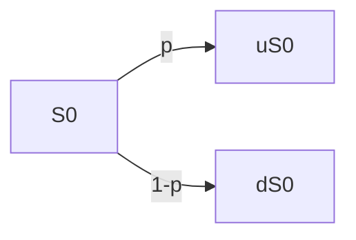

# Modèle binomial à 1 période
## Un première présentation
### Marché
- Placement sans risque au taux d'intérêt $r \gt 0$ connu/fixé
- Actif risqué de valeur  $S_0 \gt 0$ en $t = 0$ fixé et $S_1$ en $t = 1$ inconnue tel que$$S_1 = \begin{cases}
uS_0 \space avec \space probabilité \space p \in ]0,1[\\
dS_0 \space avec \space probabilité \space 1-p
\end{cases}$$où $0 \lt d \lt u$ fixé

### Hypothèse
On suppose que $d \lt 1+r \lt u$
==Pas d'arbitrage==
### Portefeuille
Partant d'une richesse initiale $x \in \mathbb R$, on achète/vend $(+ \space / \space -)\phi \in \mathbb R$ unités d'actif risqué en $t=0$  et on déboucle en $t=1$ $$\begin{aligned}
V_0 &= x \\
&= \phi S_0 + (x - \phi S_0) \\
&= Risqué+Sans \space risque\\
V1 &= \phi S_1 + (x - \phi S_0)(1+r)
\end{aligned}$$
### Option
On considère une option de payoff $g(S_1)$ et on cherche à construire un portefeuille de couverture, i.e., on veut trouver $x \in \mathbb R$ et $\phi \in \mathbb R$ tel que $$\begin{aligned}
&\phi S_1 + (x - \phi S_0)(1+r) = g(S_1) \\
\iff &\begin{cases}\phi uS_0 + (x - \phi S_0)(1+r)  = g(uS_0) \\ \phi dS_0 + (x - \phi S_0)(1+r)  = g(dS_0)\end{cases} \\
\iff &\begin{cases}\phi uS_0 - \phi dS_0 = g(uS_0) - g(dS_0) \\ (1+r)x - \phi(1+r-d) S_0 = g(dS_0)\end{cases}\\
\iff &\begin{cases}\phi = \frac {g(uS_0) - g(dS_0)}{uS_0 - dS_0} \\ x = \frac {1}{1+r}(g(dS_0) + \phi(1+r-d)S_0) &= \frac {1}{1+r}(g(dS_0) + \frac {g(uS_0) - g(dS_0)}{u\enclose{updiagonalstrike}{S_0} - d\enclose{updiagonalstrike}{S_0}}(1+r-d)\enclose{updiagonalstrike}{S_0}) \\ &= \frac {1}{1+r} [\frac {1+r-d}{u-d}g(uS_0)+(1-\frac {1+r-d}{u-d})g(dS_0)] \\&= \frac {1}{1+r}[q \space g(uS_0) +(1-q) \space g(dS_0)]\end{cases}
\end{aligned}$$ou $q=\frac {1+r-d}{u-d}$
### Conclusion
$x$ est le juste prix auquel on peut vendre l'option, on peut alors se couvrir en achetant $\phi$ unités d'actif risqué
### Remarque
On dit que le marché est complet car toutes les options sont réplicables
~={red}Ni $x$, ni $\phi$ ne dépendent de $p$ =~ 
## Notion de probabilités
### Espace de probabilités
- $\Omega = \{\omega_1, \omega_2, \omega_n\}$ ensemble fini
- $\mathcal F = \mathcal P(\Omega)$ \[*parties de Omega*] l'ensemble des évènements, appelé ***tribu***
- $\mathbb P$ mesure de probabilité, i.e., $\mathbb P : A \subset \Omega \longrightarrow \mathbb P(A) \in [0,1]$, tel que
	1. $\mathbb P(\Omega) = 1$
	2. $\mathbb P(A \cup B) = \mathbb P(A) + \mathbb P(B) \space si \space A \cap B = \emptyset$
La probabilité $\mathbb P$ est caractérisée par la donnée de $(\mathbb P(\omega))_{\omega \in \Omega}$ car $\mathbb P(A) = \sum_{\omega \in A} \mathbb P(\omega)$
*Exemple* : $\Omega = {\omega_1,\omega_2,\omega_3}$
$\mathcal P(\Omega) = \{\emptyset, \{\omega_1\}, \{\omega_2\},\{\omega_3\}, \{\omega_1, \omega_2\}, \{\omega_2, \omega_3\}, \{\omega_1, \omega_3\}, \Omega\}$
$\mathbb P(\omega_1) = \mathbb P(\omega_2) = \mathbb P(\omega_3) = \frac {1}{3}$
$\mathbb Q(\omega_1) = \frac 13, \mathbb Q(\omega_2) = \frac 23, \mathbb Q(\omega_3) = 0$
### Variable aléatoire
C'est une application $$X : \omega \in \Omega \longrightarrow X(\omega) \in \mathbb R(ou \space \mathbb R^d)$$
La loi de $X$ est la donnée de $$\mathbb P(X=x) \in [0,1], \forall x \in X(\Omega)$$
*Exemple* : On considère $$X(\omega) = \begin{cases} 0 \space &si \space \omega =\omega_1 \\ 1 \space &si \space \omega =\omega_2 \\ -1 \space &si \space \omega =\omega_3 \end{cases}$$
$$\left. \begin{matrix}
\mathbb P(X=0) = \mathbb P(\omega_1) = \frac 13 \\
\mathbb P(X=1) = \mathbb P(\omega_2) = \frac 13 \\
\mathbb P(X=-1) = \mathbb P(\omega_3) = \frac 13 
\end{matrix} \right| \implies X \sim \mathcal U(\{-1,0,1\}) \space sous \space \mathbb P$$
$$\left. \begin{matrix}
\mathbb Q(X=0) = \mathbb P(\omega_1) = \frac 13 \\
\mathbb Q(X=1) = \mathbb P(\omega_2) = \frac 23 \\
\mathbb Q(X=-1) = \mathbb P(\omega_3) = 0 
\end{matrix} \right| \implies X \sim Bernoulli(\frac 23) \space sous \space \mathbb Q$$
### Calcul d'espérance :
$$\mathbb E[X] = \sum_{\omega \in \Omega} X(\omega) \mathbb P(\omega) = \sum_{x \in X(\Omega)} x \mathbb P(X=x)$$
$$\mathbb E[f(X)] = \sum_{\omega \in \Omega} f(X(\omega)) \mathbb P(\omega) = \sum_{x \in X(\Omega)} f(x) \mathbb P(X=x)$$$\implies var(X) = \mathbb E[(X-\mathbb E[X])^2] = \mathbb E[X^2] - \mathbb E[X]^2$
*Exemple* : 
1. $X \sim Bernoulli(p)$ où $p \in [0,1]$, i.e., $\mathbb P(X=1) = 1 - \mathbb P(X=0) = p$
   On a :
   $\mathbb E[X] = 0 * \mathbb P(X=0) + 1 * \mathbb P(X=1) = p$ 
   $\mathbb E[X^2] = 0^2 * \mathbb P(X=0) + 1^2 * \mathbb P(X=1) = p$
   $var(X) = \mathbb E[X^2] - \mathbb E[X]^2 = p - p^2 = p(1-p)$
2. $X \sim \mathcal B(n,p)$ où $n \in \mathbb N^*, p \in [0,1]$, i.e. $\mathbb P(X=k) = \left( \begin{matrix}  n \\ k \end{matrix} \right) p^k (1-p)^{n-k}, \forall k \in \{1,...,n\}$  
   Puisque $X = \sum_{i=1}^n X_i$ où $(X_i)_{1 \le i \le n}$ indépendants et de même loi $Bernoulli(p)$, on a
   $\mathbb E[X] = \mathbb E \left[\sum_{i=1}^n X_i \right] \underset {car \space \mathbb E \space linéaire}{=} \sum_{i=1}^n \mathbb E[X_i] = np$ 
   $var(X) = var(\sum_{i=1}^n X_i) \underset {X \perp\!\!\!\perp Y}{=} \sum_{i=1}^n var(X_i) = np(1-p$)
### Tribu de X
C'est l'ensemble des évènements qui ne dépendent que de la réalisation de $X$, noté $\sigma (X)$
Une variable aléatoire (v.a.) $Y$ est $\sigma(X)-mesurable$ lorsque la valeur de $Y$ est connue si la valeur de $X$ est connue, i.e., $Y = f(X)$
## Le modèle revisité
### Espace de probabilité
- $\Omega = \{\omega_u, \omega_d\}$
- $\mathcal P(\Omega) = \{\emptyset, \{\omega_u\}, \{\omega_d\}, \Omega\}$
- $\mathbb P(\omega_u) = 1- \mathbb P(\omega_d) = p \in ]0,1[$
### Marché
- Taux sans risque $r \gt 0$ fixé
- Actif risqué : $S_0 \gt 0$ fixé et $S_1$ v.a. définie par : $$S_1(\omega) = \begin{cases} uS_0 \space si \space \omega = \omega_u \\ dS_o \space si \space \omega = \omega_d \end{cases}$$ où $0 \lt d \lt u$ fixés
### Portefeuille :
Étant donné $\begin{cases} x \in \mathbb R \space capital \space initial \\ \phi \in \mathbb R \space \# \space actif \space risqué \end{cases}$ on a :$$\begin{aligned}
&V_0^{x,\phi} = x = \phi S_0 + (x - \phi S_0) \\
&V_1^{x,\phi} = \phi S_1 + (x - \phi S_0)(1+r) &\space v.a.[\sigma(S_1)-mes]\\
ie \space &V_1^{x,\phi} = \phi S_1(\omega) + (x - \phi S_0)(1+r) &\forall \omega \in \Omega
\end{aligned}$$
### Arbitrage
C'est une stratégie $\phi \in \mathbb R$ tel que $$\begin{aligned}
&\mathbb P(V_1^{0,\phi} \ge 0) = 1 \space &et \space &\mathbb P(V_1^{0,\phi} \gt 0) \gt 0 \\
i.e. \space &\forall \omega \in \Omega, V_1^{0,\phi}(\omega) \ge 0 \space &et \space &\exists \omega \in \Omega,V_1^{0,\phi}(\omega) >0 
\end{aligned}$$
#### Condition AOA (Absence d'Opportunité d'Arbitrage)
Il n'y a pas d'opportunité d'arbitrage, i.e., $$\forall \phi \in  \mathbb R , V_1^{0,\phi} \ge 0 \implies V_1^{0, \phi} = 0$$
==Il est clé de voir que x=0, et donc que la valeur du portefeuille en t=1 doit être nulle==
### Option
On souhaite construire un portefeuille de réplication pour l'option de payoff $g(S_1) \space [v.a.\sigma(S_1)-mes]$ ,i.e., on cherche $x \in \mathbb R$ et $\phi \in \mathbb R$ tel que $$\begin{aligned}
&\mathbb P(V_1^{x,\phi} = g(S_1)) = 1 \\
\iff & \forall \omega \in \Omega, V_1^{x, \phi}(\omega) = g(S_1(\omega)) \\
\iff & \begin {cases} V_1^{x,\phi}(\omega_u) = g(S_1(\omega_u)) \\ V_1^{x,\phi}(\omega_d) = g(S_1(\omega_d)) \end{cases} \\
.\\.\\&idem \space partie \space 1\\.\\.\\
\iff & \begin {cases} \phi = \frac {g(uS_0) - g(dS_0)}{uS_0 - dS_0} \\ x = \frac {1}{1+r}[q \space g(uS_0) + (1-q) \space g(dS_0)] \end{cases}
\end{aligned}$$
### Probabilité risque neutre
On définit une nouvelle probabilité $\mathbb Q$ sur $\Omega$ par $$\mathbb Q(\omega_u) = 1-\mathbb Q(\omega_d) = q = \frac {1+r-d}{r-d} \in ]0,1[$$
Alors le prix de réplication s'écrit $$\begin{aligned}
x &= \frac {1}{1+r}\left(q \space g(uS_0) + (1-q) \space g(dS_0)\right) \\&= \frac {g(S_1(\omega_u))}{1+r} \mathbb Q(\omega_u) + \frac {g(S_1(\omega_d))}{1+r} \mathbb Q(\omega_d) \\&= \mathbb E^{\mathbb Q} \left[\frac {g(S_1)}{1+r}\right]
\end{aligned}$$De plus, $$\begin{aligned}
\mathbb E^{\mathbb Q}[S_1] &= S_1(\omega_u) \mathbb Q(\omega_u) + S_1(\omega_d) \mathbb Q(\omega_d) \\
&= q \space uS_0 + (1-q) \space dS_0 \\
&= \frac {1+r-\enclose{updiagonalstrike}{d}}{u-d}uS_0 + \frac {\enclose{updiagonalstrike}{u}-(1+r)}{u-d}dS_0 \\
&= \frac {1+r}{\enclose{updiagonalstrike}{u}-\enclose{updiagonalstrike}{d}}(\enclose{updiagonalstrike}{u}S_0 - \enclose{updiagonalstrike}{d}S_0) \\
&= (1+r)S_0 \\
\iff &\mathbb E^{\mathbb Q}\left[\frac {S_1}{1+r}\right] = S_0
\end{aligned} 
$$
Ainsi les rendements des placements risqués et sans risques sont identiques (d'où ~={yellow}**risque neutre**=~)
Plus généralement, $$\begin{aligned}
\mathbb E^{\mathbb Q}[V_1^{x,\phi}] &= \mathbb E^{\mathbb Q} [\phi S_1 + (x - \phi S_0)(1+r)] \\
&= \phi \mathbb E^{\mathbb Q}[S_1] + (x-\phi S_0)(1+r) \\
&= \phi (1+r)S_0 + (x-\phi S_0)(1+r) \\
&= (1+r)x \\
&= (1+r) V_0^{x,\phi} \\
\iff &\mathbb E^{\mathbb Q}\left[\frac {V_1^{x,\phi}}{1+r}\right] = V_0^{x,\phi}
\end{aligned}$$
~={yellow}Les prix actualisés sont des martingales sous $\mathbb Q$ =~
### Conséquence
En utilisant $\mathbb Q$, on peut facilement montrer l'absence d'opportunité d'arbitrage, soit $\phi \in \mathbb R$ tel que $V_1^{0,\phi} \ge 0$, on observe :$$\begin{aligned}
\mathbb E^{\mathbb Q}[V_1^{0,\phi}] &= (1+r)V_0^{0, \phi} &= 0 \\
\implies&= \underset {\gt 0}{\mathbb Q(\omega_u) }\underset {\ge 0}{V_1^{0,\phi}(\omega_u)} + \underset {\gt 0}{\mathbb Q(\omega_d)} \underset {\ge 0}{V_1^{0,\phi}(\omega_d)} &=0 \\ 
\implies &V_1^{0,\phi}(\omega_u) = V_1^{0,\phi}(\omega_d) = 0 \\
\implies &V_1^{0,\phi} = 0
\end{aligned}$$
### Remarque
Dans un modèle plus général (*non limité aux évènements $u$ et $d$, mais étendus à $n$ valeurs*), on peut montrer que l'existence d'une probabilité risque neutre est équivalente à AOA.
Si une option de payoff $g(S_1)$ est replicable, alors son prix est : $$\mathbb E^{\mathbb Q}\left[ \frac {g(S_1)}{1+r}\right] = \mathbb E^{\mathbb Q}\left[ \frac {V_1^{x,\phi}}{1+r}\right] = V_0^{x,\phi} = x$$
# Modèle Binomial à plusieurs périodes
## Une première présentation
On suppose que $T = 2$ périodes
### Marché
- Taux d'intérêt sans risque $r \gt 0$ sur chaque période
- Actif risqué
```mermaid
 graph LR
 subgraph A["S"]
 direction LR
 S0(""$$S_0$$"") --> uS0("$$uS_0$$")
 S0 --> dS0("$$dS_0$$")
 uS0 --> uuS0("$$u^2S_0$$")
 uS0 --> udS0("$$udS_0$$")
 dS0 --> ddS0("$$d^2S_0$$")
 dS0 --> udS0("$$udS_0$$")
 end
 
 subgraph B["C"]
 direction LR
 C0(""$$C_0$$"") --> C1uS0("$$C_1(uS_0)$$")
 C0 --> C1dS0("$$C_1(dS_0)$$")
 C1uS0 --> guuS0("$$g(u^2S_0)$$")
 C1uS0 --> gudS0("$$g(udS_0)$$")
 C1dS0 --> gddS0("$$g(d^2S_0)$$")
 C1dS0 --> gudS0("$$g(udS_0)$$")
 end
  A --- B
 ```
### Hypothèse
~={yellow} $d \lt 1+r \lt u$ =~
### Option
On considère une option de payoff $g(S_2)$ et on cherche à déterminer un portefeuille de couverture.
On peut raisonner par récurrence rétrograde :
- $t = 2$ : le prix de l'option correspond à son payoff $g(S_2)$
- $t=1$ : Il s'agit d'une option expirant dans une période et donc on peut raisonner comme dans le **chapitre 1**, étant donné $S_1$, on a :
	- $C_1(S_1) = \frac {1}{1+r}(q \space g(uS_1) + (1-q) \space g(dS_1))$
	- $\phi_1 = \frac {g(uS_1) - g(dS_1)}{uS_1 - dS_1}$
- $t = 0$ : Il s'agit d'un produit dérivée de payoff $C_1(S_1)$ dans une période :
	- $C_0 = \frac {1}{1+r}(q \space C_1(uS_0)  + (1-q) \space C_1(dS_0)) = \frac {1}{(1+r)^2}(q^2 g(u^2S_0) + 2q(1-q) g(udS_0) + (1-q)^2 g(d^2S_0)$
	- $\phi_0 = \frac {C_1(uS_0) - C_1(dS_0)}{uS_0 - dS_0}$
	
## Notions de probabilité
### Processus stochastique
C'est une famille $X = (X_0,X_1,...,X_T)$ *(qu'on écrit aussi $(X_t)_{t \in \{0,...,T\}}$)* de v.a. décrivant l'évolution d'un phénomène aléatoire au cours du temps, e.g., le cours d'une action
### Filtration de $X$
C'est le flux d'information $\mathcal (F_t)_{t \in \{0,..,T\}}$ associé à l'évolution $X$, i.e., $\mathcal F_t = \sigma(X_0,...,X_t)$ correspond ç l'ensemble des évènements qui ne dépendent que de la réalisation de $(X_0,...,X_t)$
### Adapté
On dit qu'un processus $Y$ est adapté à la filtration lorsque $Y_t$ est $\mathcal F_t-mesurable \space \forall t \in \{0,...,T\}$, i.e., $Y_t = f(X_0,...,X_t)$.
~={yellow}Connaitre $(X_0,...,X_t)$ c'est connaître $Y_t$ =~
### Martingales
On dit qu'un processus $Y$ est ***martingale par rapport à la filtration*** lorsque $$\mathbb E[Y_{t+1} | \mathcal F_t] = Y_t, \forall t \in \{0,...,T-1\}$$
Ou de manière équivalente :$$\mathbb E[Y_s | \mathcal F_t] = Y_t, \forall 0 \le t \le s \le T$$
### Espérance conditionnelle
Soit $B \subset \Omega$ tel que $\mathbb P(B) \gt 0$, on rappelle que $$\mathbb P(A|B) = \frac {\mathbb P(A \cap B)}{\mathbb P(B)}, \forall A \subset \Omega$$
Soient $X,Y$ v.a. on peut définir $$\mathbb E[X |Y=y] = \sum_{x \in X(\Omega)} x \space \mathbb P(X=x | Y=y), \forall y \in Y(\Omega)$$
Et également $$\begin{aligned} 
\mathbb E[X|\sigma(Y)](\omega) &= \mathbb E[X | Y](\omega) \\
&= \mathbb E[X|Y=y] \space si \space Y(\omega) = y
\end{aligned}$$
En particulier, $\mathbb E[X|Y]$ est une **Variable Aléatoire** $\sigma(Y)-mesurable$ (~={yellow} $\mathbb E[X|Y]$ est connue si $Y$ est connue=~)
*Exemple* : $X \sim U(\{1,..,6\})$ le résultat d'un dé
$$Y = \begin{cases}
1 \space si \space X \space pair \\
0 \space sinon
\end{cases}$$
$$\begin{aligned}
\mathbb E[X | Y=1] &= \sum_{x=1}^6 x &\underline{\mathbb P(X = x | Y = 1)} \\
&&= \frac {\mathbb P(X=x, Y=1)}{\mathbb P(Y=1)}\\
&&= \begin{cases} 0 \space si \space x \space est \space impair \\ \frac {\mathbb P(X=x)}{\mathbb P(Y=1)} = \frac {1/6}{1/2} = \frac 13\end{cases} \\
&= 2 * \frac 13 + 4* \frac 13 + 6 * \frac 13 \\
&= 4
\end{aligned}$$
$$\mathbb E[X | Y=0] = 1 * \frac 13 + 3 * \frac 13 + 5 * \frac 13 = 3$$
$$\mathbb E[X|Y](\omega) = \begin{cases} 4 \space si \space Y(\omega) = 1 \\ 3 \space si \space Y(\omega) = 0\end{cases}$$
#### Propriétés
1. Si $X \perp\!\!\!\perp Y$, alors $\mathbb E[X|Y] = \mathbb E[X]$
2. Si $X$ est $\sigma(Y) - mesurable$, alors $\mathbb E[X|Y] = X$
3. $\mathbb E[\mathbb E[X|Y]]= \mathbb E[X]$ 
#### Preuve
1. Si $X \perp\!\!\!\perp Y$, alors $$\begin{aligned}
   \mathbb E[X|Y=y] &= \sum_{x \in X(\Omega)} x \space \mathbb P(X=x|Y=y) \\
   &= \sum_{x \in X(\Omega)} x \space \mathbb P(X=x) \\
   &= \mathbb E[X]
   \end{aligned}$$
2. Si X est $\sigma(Y)-mesurable$, alors $X = f(Y)$ et $$\begin{aligned}
   \mathbb E[X|Y=y] &= \sum_{x \in X(\Omega)} x \space \mathbb P(X=x|Y=y) \\
   &= \sum_{x \in X(\Omega)} x \space \mathbb P(f(Y)=x|Y=y) \\
   &= \sum_{x \in X(\Omega)} x \times \space \begin{cases} 1 \space si \space x=f(y) \\ 0 \space sinon\end{cases} \\
   &=f(y)
   \end{aligned}$$
   $$\mathbb E[X|Y](\omega) = f(Y(\omega)) = X(\omega)$$
3. $$\begin{aligned}
   \mathbb E[\mathbb E[X|Y]] &= \sum_{y \in Y(\Omega)} \mathbb E[X|Y=y] \mathbb P(Y=y) \\
   &= \sum_y \sum_x x \space \mathbb P(X=x|Y=y) \mathbb P(Y=y) \\
   &= \sum_y \sum_x x \space \frac {\mathbb P(X=x,Y=y)}{\enclose{updiagonalstrike}{\mathbb P(Y=y)}} \enclose{updiagonalstrike}{\mathbb P(Y=y)} \\
   &= \sum_x x \sum_y \mathbb P(X=x, Y=y) \\
  par \space proba \space totale &= \sum_x x\mathbb P(X=x) \\
   &= \mathbb E[X]
   \end{aligned}$$
### Conséquence
Une martingale est nécessairement un processus adapté et d'espérance constante.
En effet $$\mathbb E[Y_t] = \mathbb E[\mathbb E[Y_t | \mathcal F_0]] = \mathbb E[Y_0]$$
## Le modèle revisité
### Description
#### Espace de Probabilité
- $\Omega = \{\omega_u, \omega_d\}^T$, i.e., $\omega = (\omega_1,...,\omega_T)$ avec $\omega_t \in \{\omega_u, \omega_d\}$
- $\mathcal F = \mathcal P(\Omega)$
- $\mathbb P(\omega) \gt 0, \forall \omega \in \Omega$
#### Marché
- Taux d'intérêt sans risque $r \gt 0$ fixé sur chaque période
- Actif risqué $S_0 \gt 0$ fixé et $$S_{t+1}(\omega) = \begin{cases}uS_t(\omega) \space si \space \omega_{t+1} = \omega_u \\ dS_t(\omega) \space si \space \omega_{t+1} = \omega_d\end{cases}$$*Ex* :~={green} $\omega = (\omega_u, \omega_u, \omega_d)$ =~ou~={red} $\omega = (\omega_d, \omega_u, \omega_d)$ =~
```mermaid
 graph LR
 S0(""$$S_0$$"") --> uS0("$$uS_0$$"):::green
 S0 --> dS0("$$dS_0$$"):::red
 uS0 --> uuS0("$$u^2S_0$$"):::green
 uS0 --> udS0("$$udS_0$$")
 dS0 --> ddS0("$$d^2S_0$$")
 dS0 --> udS0("$$udS_0$$"):::red
 uuS0 --> uuuS0("$$u^3S_0$$")
 uuS0 --> uudS0("$$u^2dS_0$$"):::green
 udS0 --> uudS0("$$u^2dS_0$$")
 udS0 --> uddS0("$$ud^2S_0$$"):::red
 ddS0 --> uddS0("$$ud^2S_0$$")
 ddS0 --> dddS0("$$d^3S_0$$")
 classDef red stroke:#f00
 classDef green stroke:#0f0
```
- $\mathcal F_t = \sigma(\enclose{updiagonalstrike}{S_0}, S_1,.....,S_t)$ filtration de S
#### Portefeuille
- $x \in \mathbb R$ capital initial
- $(\phi_t)_{t \in \{0,....,T-1\}}$ stratégie, i.e. $\phi_t$ $\#$ **actif risqué entre** $t$ et $t+1$ ($\phi$ processus adapté, i.e., $\phi_t \space \mathcal F_t-mesurable$)
- Valeur $$\begin{aligned}
  &V_t^{x,\phi} = \underset{risqué}{\phi_t S_t} + \underset{sansRisque}{(V_t^{x,\phi} - \phi_t S_t)} \\ 
  &V_{t+1}^{x,\phi} = \underset{risqué}{\phi_t S_{t+1}} + \underset{sansRisque}{(V_{t}^{x,\phi} - \phi_t S_t)(1+r)} \\
  \implies &\frac {V_{t+1}^{x,\phi}}{(1+r)^{t+1}} = \frac {\phi_t S_{t+1} + (V_{t}^{x,\phi} - \phi_t S_t)\enclose{updiagonalstrike}{(1+r)}}{(1+r)^{t+\enclose{updiagonalstrike}{1}}} \\
  \implies &\tilde V_{t+1}^{x,\phi} = \phi_t \tilde S_{t+1} + \tilde V_t^{x,\phi} - \phi_t \tilde S_t \\
  \implies &\tilde V_{t+1}^{x,\phi} = \tilde V_t^{x,\phi} +\phi_t (\tilde S_{t+1}  -\tilde S_t) \\
  mais \space puisque \space &\tilde V_{t}^{x,\phi} = \tilde V_0^{x,\phi} + \sum_{s=0}^{t-1}(\tilde V_{s+1}^{x,\phi} - \tilde V_{s}^{x,\phi}) \\
  \implies &\tilde V_{t}^{x,\phi} = x + \sum_{s=0}^{t-1}\phi_s(\tilde S_{s+1}^{x,\phi} - \tilde S_{s}^{x,\phi})
  \end{aligned}$$où $\tilde X_t = \frac {X_t}{(1+r^t)}$ ~={yellow}**valeur actualisée**=~
### Arbitrage et Martingale
#### Arbitrage
C'est une stratégie $\phi$ tq $$V_t^{0,\phi} \ge 0, \forall \omega \in \Omega \space \text{et} \space \exists \omega \in \Omega, V_t^{0,\phi}(\omega) \gt 0$$ Autrement dit : $$\mathbb P(V_t^{0,\phi} \ge 0) = 1 \text{ et } \mathbb P(V_t^{0,\phi} \gt 0) \gt 0$$
#### Hypothèse
On suppose $d \lt 1+r \lt u$
#### Probabilité risque neutre
On considère la probabilité $\mathbb Q$ tel que les rendements $\left( \frac {S_t}{S_{t+1}}\right)_{t \in \{1,...,T\}}$ sont indépendants et de même loi $$\begin{aligned}
\mathbb Q(\frac {S_t}{S_{t+1}} = u) &= 1 - \mathbb Q(\frac {S_t}{S_{t+1}} = d) \\
&= q = \frac {1+r-d}{u-d} \in ]0,1[
\end{aligned}$$
#### Martingales
On observe que $(\tilde S_t)_{t \in \{0,...,T\}}$ est une $\mathbb Q-martingale$. En effet $$\begin{aligned}
\mathbb E^{\mathbb Q}[\tilde S_{t+1} | \mathcal F_t] &= \mathbb E^{\mathbb Q} \left[\tilde S_t \frac {S_{t+1}}{S_t}| \mathcal F_t \right] \\
&= \tilde S_t \mathbb E\left[\frac {\tilde S_{t+1}}{\tilde S_t}\right] \Bigg| \color{yellow}{ \text{ car } \tilde S_t \space \mathcal F_t-mes \text{ et } \frac {\tilde S_{t+1}}{\tilde S_t} \perp\!\!\!\perp \mathcal F_t \text { sous } \mathbb Q}\\
&= \tilde S_t \space \underset{\color{yellow}{=1}}{\underline{(q\frac {u}{1+r} + (1-q) \frac {d}{1+r})}} \\
&=\tilde S_t \\
\iff \mathbb E^{\mathbb Q}[S_{t+1} | \mathcal F_t] &= (1+r)S_t
\end{aligned}$$
De plus, $(\tilde V_t^{x,\phi})_{t  \in \{0,...,T\}}$ est une $\mathbb Q-martingale$ 
En effet $$\begin{aligned}
\mathbb E^{\mathbb Q}[\tilde V_{t+1}^{x,\phi} | \mathcal F_t] &= \mathbb E^{\mathbb Q}[\tilde V_{t}^{x,\phi} + \phi_t(\tilde S_{t+1}^{x,\phi} - \tilde S_{t}^{x,\phi})|\mathcal F_t) \\
&=\tilde V_{t}^{x,\phi} + \phi_t \mathbb E^{\mathbb Q}[\tilde S_{t+1}^{x,\phi} - \tilde S_{t}^{x,\phi} | \mathcal F_t] \\
&=\tilde V_{t}^{x,\phi} + \phi_t (\mathbb E^{\mathbb Q}[\tilde S_{t+1}^{x,\phi} | \mathcal F_t] - \tilde S_{t}^{x,\phi}) \\
&=\tilde V_{t}^{x,\phi} + \phi_t (\tilde S_{t}^{x,\phi} - \tilde S_{t}^{x,\phi}) \\
&= \tilde V_{t}^{x,\phi}
\end{aligned}$$
En particulier $$\begin{aligned}
\mathbb E^{\mathbb  Q}[\tilde V_{t}^{x,\phi}] = \mathbb E^{\mathbb  Q}[\tilde V_{0}^{x,\phi}] = \tilde V_{0}^{x,\phi} = x \\ 
\iff \mathbb E^{\mathbb  Q}[ V_{t}^{x,\phi}] = (1+r)^T x
\end{aligned}$$
#### Conséquence
On peut en déduire l'AOA. En effet, soit $\phi$ stratégie tel que $\forall \omega, V_t^{0,\phi}(\omega) \ge 0$, on a donc$$\begin{aligned}
\mathbb E^{\mathbb Q}[V_T^{0,\phi}] &= 0 =(1+r)^T*0 \color{yellow}{\text{ comme vu plus haut}} \\
&=\sum_{\omega \in \Omega}\underset{\ge 0}{\underline{V_T^{0,\phi}(\omega)}} \space \space \underset{\gt 0}{\underline{\mathbb Q(\omega)}} \\
\implies &V_T^{0,\phi}(\omega) = 0, \forall \omega \in \Omega \\
\implies &\enclose{updiagonalstrike}{\exists}\omega, V_T^{0,\phi}(\omega) = 0 \\
\implies &\color{green}{\text{pas d'arbitrage}}
\end{aligned}$$
### Option Européenne
On considère un payoff de la forme $g(S_t)$ et on cherche à construire un portefeuille de couverture, i.e., trouver $x \in \mathbb R$ et une stratégie $(\phi_t)$ tel que $$V_t^{x,\phi} = g(S_t)$$
#### Remarque
Si on a trouvé ce portefeuille de couverture, alors le prix de réplication de l'option est~={yellow} l'espérance actualisée sous $\mathbb Q$  de $g(S_t)$ =~$$\begin{aligned}
\mathbb E^{\mathbb Q}\left[\frac {g(S_t)}{(1+r)^T} \right] &= \mathbb E^{\mathbb Q}\left[\tilde V_T^{x,\phi} \right] = \color{lightgreen}{x} \\
&= \sum_{k=0}^T\left( \begin{matrix}T \\ k \end{matrix} \right)q^k(1-q)^{T-k}\frac {g(u^kd^{T-k}S_0)}{(1+r)^T}
\end{aligned}$$
L'idée est de déterminer le prix $Y_t$ de l'option et la stratégie $\phi_t$ par récurrence rétrograde
- $t=T$ : $Y_T = g(S_T) \color{red}{= C_T(S_T)}$
- $t = T-1$ : $$\begin{aligned}
  &\phi_{T-1}S_t + (Y_{T-1} - \phi_{T-1} S_{T-1})(1+r) = g(S_T) = Y_T \\
  \iff &\begin{cases}
	  \phi_{T-1}uS_{T-1} + (Y_{T-1} - \phi_{T-1} S_{T-1})(1+r) = g(uS_{T-1}) \\
	  \phi_{T-1}dS_{T-1} + (Y_{T-1} - \phi_{T-1} S_{T-1})(1+r) = g(dS_{T-1})
	  \end{cases} \\
  \iff &\begin{cases}
	  \phi_{T-1} = \frac {g(uS_{T-1}) - g(dS_{T-1})}{uS_{T-1} - dS_{T-1}} \Bigg| \color{red}{\mathcal F_{T-1}-mesurable}\\
	  Y_{T-1} = \frac{1}{1+r}\big(q*g(uS_{T-1}) + (1-q) * g(dS_{T-1})\big) \color{red}{= C_{T-1}(S_{T-1})}
	  \end{cases}
  \end{aligned}$$
- $t \rightarrow t-1$ : Nous utilisons la même méthode, mais en passant par $C_t$ au lieu de $g$  $$\begin{aligned}
  &\phi_{t-1}S_t + (Y_{t-1} - \phi_{t-1} S_{t-1})(1+r) = Y_t \color{green}{= C_t(S_t)} \\
  \iff &\begin{cases}
	  \phi_{t-1}uS_{t-1} + (Y_{t-1} - \phi_{t-1} S_{t-1})(1+r) = C_t(uS_{t-1}) \\
	  \phi_{t-1}dS_{t-1} + (Y_{t-1} - \phi_{t-1} S_{t-1})(1+r) = C_t(dS_{t-1})
	  \end{cases} \\
  \iff &\begin{cases}
	  \phi_{t-1} = \frac {C_t(uS_{t-1}) - C_t(dS_{t-1})}{uS_{t-1} - dS_{t-1}} \Bigg| \color{red}{\mathcal F_{t-1}-mesurable} \\
	  \begin{aligned}Y_{t-1} &= \frac{1}{1+r} \textcolor{yellow}{\big(q*C_t(uS_{t-1}) + (1-q) * C_t(dS_{t-1}) \big)}\\
	  &= \frac {1}{1+r} \textcolor{yellow}{\mathbb E^{\mathbb Q}[Y_t | \mathcal F_{t-1}]}\end{aligned}
	  \end{cases}
  \end{aligned}$$
  Ceci permet de déterminer $Y_0 \in \mathbb R$ et la stratégie $(\phi_t)_{t \in \{0,...,T-1\}}$. On peut vérifier que $$V_t^{Y_0, \phi} = Y_t$$ et on a bien ~={yellow}construit un portefeuille de couverture=~
#### Remarque 2
$(\tilde Y_t)_{t \in \{0,...,T\}}$ est une $\mathbb Q-martingale$ donc $$\begin{aligned}
&\tilde Y_t = \mathbb E^{\mathbb Q}[\tilde Y_{t+1} |\mathcal F_t] \iff Y_t = \frac {1}{1+r} \mathbb E^{\mathbb Q}[Y_{t+1}|\mathcal F_t] \\ &et \\
&\tilde Y_t = \mathbb E^{\mathbb Q}[\tilde Y_T | \mathcal F_t] \iff Y_t = \frac {1}{(1+r)^{T-t}} \mathbb E^{\mathbb Q}[g(S_T) | \mathcal F_t]
\end{aligned}$$
Plus généralement, on considère un payoff de la forme $g(S_1,...,S_T)$ et on peut de la même manière construire un portefeuille de réplication.
- $t=T$ : $Y_T = g(S_1,...,S_T) \color{red}{= C_T(S_1,...,S_T)}$
- $t \rightarrow t-1$ :   $$\begin{aligned}
  &\phi_{t-1}S_t + (Y_{t-1} - \phi_{t-1} S_{t-1})(1+r) = Y_t \color{green}{= C_t(S_1,...,S_t)} \\
  \iff &\begin{cases}
	  \phi_{t-1}uS_{t-1} + (Y_{t-1} - \phi_{t-1} S_{t-1})(1+r) = C_t(S1,...,uS_{t-1}) \\
	  \phi_{t-1}dS_{t-1} + (Y_{t-1} - \phi_{t-1} S_{t-1})(1+r) = C_t(S1,...,dS_{t-1})
	  \end{cases} \\
  \iff &\begin{cases}
	  \phi_{t-1} = \frac {C_t(S1,...,S_{t-1},uS_{t-1}) - C_t(S1,...,S_{t-1},dS_{t-1})}{uS_{t-1} - dS_{t-1}} \Bigg| \color{red}{\mathcal F_{t-1}-mesurable} \\
	  \begin{aligned}Y_{t-1} &= \frac{1}{1+r} \textcolor{yellow}{\big(q*C_t(S1,...,S_{t-1},uS_{t-1}) + (1-q) * C_t(S1,...,S_{t-1},dS_{t-1})) \big)}\\
	  &= \frac {1}{1+r} \textcolor{yellow}{\mathbb E^{\mathbb Q}[Y_t | \mathcal F_{t-1}]} \end{aligned}
	  \end{cases}
  \end{aligned}$$
==Le marché est complet==
