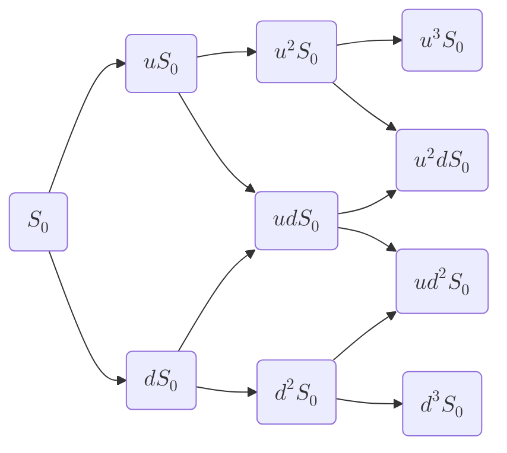

# Pricing des options exotiques
## Méthodes Numériques
Il existe deux catégories de méthodes numériques :
### Méthodes Backward
Comme :
- Les arbres
- Les EDPs (Equations aux Dérivées Partielles)
![[Pasted image 20251205172125.png]]

#### Modèle Binomial (Arbre de Cox, Ross, Rubinstein \[CRR])

Le modèle se présente ainsi :

Nous avons :
- $q$ \[proba risque neutre] = $\frac {e^{r \Delta t} - d}{u - d}$
- $u = e^{\sigma \sqrt{\Delta t}}$
- $d = e^{-\sigma \sqrt{\Delta t}}$
- En tendant $\Delta t$ vers 0 (*nombre de pas de temps infini*) on converge vers le modèle de Black & Scholes
##### Pricing sous CRR
Pour pricer une option dans ce modèle, on considère que le prix en $t - \Delta t$ correspond à l'**espérance actualisée** du prix en $t$
$$V_{t - \Delta t, i} = e^{-r \Delta T}(pV_{t,i+1} + (1-p)V_{t,i-1})$$

##### Exemple d'un put américain
**Payoff à maturité $T$** : $P_{T,i} = max(K - S_{T,i},0)$
**Rétropropagation du payoff aux dates antérieures** : $$P_{t-\Delta t,i} = max(e^{-r \Delta T}(pP_{t,i+1} + (1-p)P_{t,i-1}), K - S_{t - \Delta t,i})$$
### Méthodes forward
#### Monte Carlo
Si l'on se place sous hypothèse d'AOA, le prix d'un actif financier s'exprime sous forme d'une **espérance mathématique** calculée sous la mesure de *probabilité risque neutre*
**Monte Carlo** utilise la ***Loi des Grands Nombres*** pour estimer cette espérance via une **moyenne empirique**
Cette estimation présente une marge d'erreur, pour cela, nous utiliserons le **Théorème Central Limite** pour définir un **Intervalle de Confiance**

##### Loi des grands nombres
Soit $X_1,X_2,.....,X_n$ une suite de Variables Aléatoires indépendantes et de même loi ($i.i.d.$)
Alors, leur **moyenne empirique** converge vers l'**espérance** de ces variables
$$\hat m_n := \frac {X_1+X_2+...+X_n}{n} \longrightarrow \mathbb E[X_1]$$
==L'idée de la méthode de Monte Carlo est d'estimer l'espérance via la moyenne empirique issue de la simulation de ces variables aléatoires==
##### Théorème Central Limite
Soit $X_1,X_2,.....,X_n$ une suite de Variables Aléatoires indépendantes et de même loi ($i.i.d.$)
Alors :$$\sqrt {n} (\frac {X_1+X_2+...+X_n}{n} - \mathbb E[X_1]) \xrightarrow{loi} \mathcal N(0,Var[X_1])$$
Ce qui équivaut à dire :$$\frac {\sqrt {n}}{\hat \sigma_n} (\frac {X_1+X_2+...+X_n}{n} - \mathbb E[X_1])\mathbb 1_{\hat \sigma_n \gt 0} \xrightarrow{loi} \mathcal N(0,1)$$
Avec :
$\hat \sigma_n^2$ \[Variance empirique] $= \frac {1}{n-1} \sum_{i=1}^n(X_i - \frac {X_1+....+X_n}{n})^2$

###### L'**Intervalle de confiance $\alpha$** : $$[\hat m_n - \eta \frac {\hat \sigma_n}{\sqrt {n}}, \hat m_n + \eta \frac {\hat \sigma_n}{\sqrt {n}}]$$
Avec : $\eta = q_{1 - \frac {\alpha}{2}}$ (le quartile d'ordre $1-\alpha/2$)

Cas **$\alpha = 95\%$**:$$[\hat m_n - 1.96 \frac {\hat \sigma_n}{\sqrt {n}}, \hat m_n + 1.96 \frac {\hat \sigma_n}{\sqrt {n}}]$$
##### Simulation de variables gaussiennes
La plupart des générateurs permettent d'obtenir des tirages indépendants de loi uniforme \[0,1].
Pour passer de l'Uniforme à la Normale, soit :
- On utilise l'inverse de la fonction de répartition de la loi Normale
- On utilise Box-Muller
Pour simuler une $\mathcal N(0,\Delta t)$ à partir d'une $\mathcal N(0,1)$ (comme dans le cas d'un mouvement brownien entre $t$ et $t + \Delta t$) :
- On a : $$\mathcal N(0,\Delta t) = \sqrt {\Delta t} * \mathcal N(0,1)$$
##### Avantages et Inconvénients de Monte Carlo
###### Avantages
- Méthode très intuitive
- Implémentable facilement
- Possible pour tous les modèles
- Permettant de pricer tout type de payoff *path dependent*
###### Inconvénients
- Inadapté aux options américaines / bermudéennes
- Gourmand en temps de calcul
- Peu précis **(On recourt donc aux méthodes de réduction de variance)**
# Au-delà de Black and Scholes
## Problématique
Bien que souvent utilisé, le modèle de B&S est très imparfait, pour deux raisons principales :
1. La **dynamique** des actifs est incohérente avec l'observation empirique
2. Non prise en compte du **smile/skew** de volatilité
Cela a donc un effet sur l'évaluation de certains risques exotiques comme :
- Le ***risque digital***
- Le ***risque de volatilité forward***
**Solution** : Utiliser des modèles permettant une **calibration sur le smile**
- Modèles à volatilité locale
- Modèles à sauts
- Modèles à volatilité stochastique

## Modèles à volatilité locale
L'idée est d'avoir une volatilité qui dépend de $S_t$ et du temps $t$
$$\begin{aligned} &\frac {dS_t}{S_t} = \mu(t) dt + \sigma(t,S_t)dW_t \space,  &\mu(t) = r(t) - \gamma(t) \end{aligned}$$
Avec $\sigma$, **fonction déterministe** de $t$ et $S_t$ à calibrer pour correspondre au *smile* de vol.
### Formule de Dupire
Dupire nous donne une formule explicite donnant la volatilité locale $\sigma(t,S_t)$ cohérente avec le prix des options, en se basant sur les prix call/put pour tout strike/maturité du marché.
$$\sigma^2(T,K) = 2 \frac {\frac {\partial C}{\partial T} + \gamma(T)C + K[r(T) - \gamma(T)]\frac {\partial C}{\partial K}}{K^2 \frac {\partial^2 C}{\partial K^2}}$$

On peut aussi exprimer la **volatilité locale** en fonction de la **surface de volatilité implicite**
$$\sigma^2(T,K) = \frac {2 \frac {\partial \hat \sigma}{\partial T} + \frac {\hat \sigma}{T-t} +2K[r(T) - \gamma(T)]\frac {\partial \hat \sigma}{\partial K}}{K^2[\frac {\partial^2 \hat \sigma}{\partial K^2} - d + \sqrt{T-t} \space (\frac {\partial \hat \sigma}{\partial K})^2+ \frac {1}{\hat \sigma}(\frac {1}{K \sqrt{T-t}} + d + \frac {\partial \hat \sigma}{\partial K})^2]}$$
### En pratique
- On construit une nappe régulière à partir des volatilités de marché
- On l'utilise pour calculer la volatilité locale via la *formule de dupire*

### Avantages et Inconvénients de la volatilité locale
#### Avantages
- Calibration simple et rapide
- Implémentation facile avec méthodes numériques (MC / Arbre / EDP)
#### Inconvénients
- Dépendance de la volatilité locale / méthode de lissage de la volatilité de marché
- Volatilité déterministe
- Dynamique de smile inconsistante 
## Modèles à sauts
aa
## Modèles à volatilité stochastique
Seuls modèles réellement capables d'appréhender **le risque de volatilité forward**
### Modèle de Heston
$$\begin{aligned}
&dS_t = \mu S_t dt + \sqrt{v_t}S_tdW_t^S \\
&dv_t = \kappa(\theta - v_t)dt + \xi \sqrt{v_t}dW_t^v
\end{aligned}$$
### Modèle SABR
Avec une valeur initiale du forward $F_0$ on a les paramètres suivants pour le modèle :
- $\sigma_0$ : Volatilité initiale
- $\alpha$ : Volatilité de la volatilité
- $\beta$ : Exposant CEV
- $\rho$ : Corrélation des forward / vol
$$\begin{aligned}
&dF_t = \sigma_t F_t^\beta dW_t^1 \\
&\frac{d\sigma_t}{\sigma_t} = \alpha \space dW_t^2
\end{aligned}$$
#### Formule SABR
![[Pasted image 20251206174003.png]]

#### Impact du paramétrage
![[Pasted image 20251206174025.png]]
#### Forces de SABR
- Modèle à volatilité stochastique qui génère des formes de smile proche de la réalité
- Formule fermée assez précise donnant la volatilité implicite
- Impact du paramétrage facilement interprétable
- Vega-hedge facilité
- C'est un standard pour les options de taux