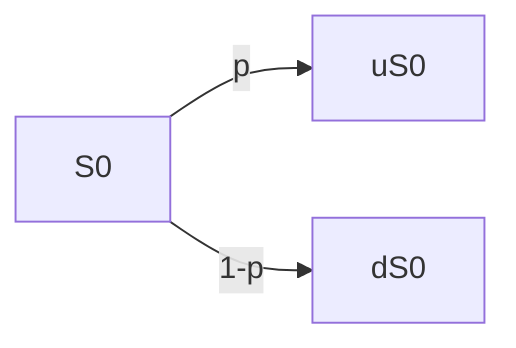
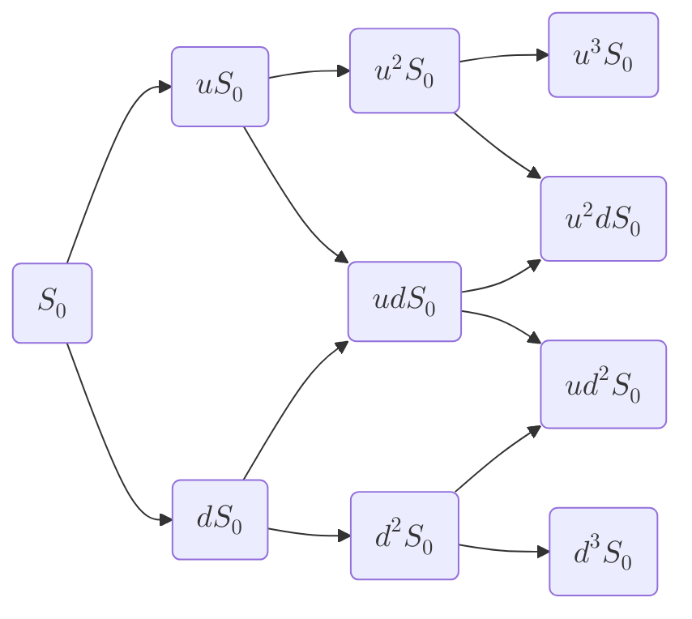

# Rappels
# Sensis
![[Pasted image 20251204100242.png]]

# AOA
L'AOA est l'hypothèse d'Absence d'Opportunité d'Arbitrage (gain sans risque).
**Un arbitrage** : $X_0 = 0, X_T \ge 0 \space et \space P(X_t \gt 0) \gt 0$

AOA $\implies$ $(X_T = Y_T \implies  X_0 = Y_0)$
*Démonstration* :
- Par l'absurde : **Supposons** $X_T = Y_T \space et \space X_0 \gt Y_0$  On vend (*à découvert*) $X_0$ et on achète $Y_0$, on gagne aujourd'hui $X_0-Y_0$ qu'on place. En $T$ on a $(X_0 - Y_0)*(1+r)^T - X_T + Y_T = (X_0 - Y_0)*(1+r)^T$ car $X_T = Y_T$.   
# Prix d'une option
Le prix d'une option est la valeur $X_0$ en $t = 0$ de son portefeuille de réplication.
*Exemple* :
- On veut couvrir un call (dont le payoff est bien-sûr ($S_t - K)^+$)
- On va donc déterminer un portefeuille $X$ tel que $X_T = (S_t-K)^+$
- Le prix de notre call sera donc de $X_0$ (valeur en $t = 0$ de $X$)

# Les modèles binomiaux
## Modèle a une période 

## Modèle à n périodes

# Modèle de Black and Scholes
Le modèle de Black and Scholes suppose une dynamique **log-normale** sur le prix de l'actif sous-jacent.
*Sous la mesure risque-neutre* : $\frac {dS_t}{S_t} = rdt + \sigma dW_t$
***Solution explicite*** : $S_T = S_0 e^{(r-\sigma^2/2)T+\sigma W_T}$
Avec:
- $W_T$ : Valeur en T du *mouvement brownien* (**qui suit une loi normale de variance T**)
- $log(S_T)$ : Suit une loi normale
## Pricing d'options sous B&S
### Sans dividendes
$$\begin{aligned} C_0 &= e^{-rT} \mathbb E^Q((S_T - K)^+) \\
&= e^{-rT} \int_{-\infty}^{+\infty} (S_0e^{(r-\sigma^2/2)T+\sigma \sqrt{T}x}-K)^+\frac {1}{\sqrt{2 \pi}}e^{-x^2/2}dx\end{aligned}$$
Ce qui donne après calcul :
$$C_0 = S_0 \mathcal N(d_1) - Ke^{-rT} \mathcal N(d_2)$$
$$P_0 = Ke^{-rT} \mathcal N(-d_2) - S_0 \mathcal N(-d_1) $$
Avec :
$$\begin{aligned} d_1 &= \frac {ln(S_0/K) + (r+\sigma^2/2)T}{\sigma \sqrt{T}}  
&d2 = d1-\sigma \sqrt{T} \space \space \space \space \space \space \space \space
\mathcal N(x) = \int_{-\infty}^{+\infty} \frac {1}{\sqrt{2 \pi}}e^{-u^2/2}du \end{aligned}$$

### Avec Dividendes
On a :
$$\frac {dS_t}{S_t} = (r-d)dt + \sigma dW_t$$

Ce qui donne :
$$C_0 = S_0 e^{-dT} \mathcal N(d_1) - Ke^{-rT} \mathcal N(d_2)$$
$$P_0 = Ke^{-rT} \mathcal N(-d_2) - S_0 e^{-dT} \mathcal N(-d_1) $$
Avec :
$$\begin{aligned} d_1 &= \frac {ln(S_0/K) + (r-d+\sigma^2/2)T}{\sigma \sqrt{T}}  
&d2 = d1-\sigma \sqrt{T} \space \space \space \space \space \space \space \space
 \end{aligned}$$

## Prix d'un call
![[Pasted image 20251204121615.png]]

## Prix d'un put
![[Pasted image 20251204121637.png]]

## Valeur Intrinsèque vs Valeur Temps
![[Pasted image 20251204121700.png]]
==La valeur intrinsèque est la valeur du **Forward** sous-jacent, la valeur temps est la différence entre la valeur de l'option et sa valeur intrinsèque==

## Evolution des grecques en fonction de $S_0$
![[Pasted image 20251204121838.png]]

# P&L du Market Maker 
## Gamma vs Thêta
*Hypothèse : r=0*
**Position en $t$** : Short call + hedge.
**P&L en $t+\delta t$**  : $V_{t + \delta t} = -(C_{t + \delta t} - C_t)+\Delta_t(S_{t + \delta t} - S_t)$
**Grâce à un développement de Taylor à l'ordre 2** : $C_{t + \delta t} - C_t \approx \theta_t \delta t + \Delta_t(S_{t + \delta t } - S_t) + \frac {1}{2} \Gamma_t(S_{t + \delta t } - S_t)^2$
**En remplaçant dans le P&L** : 
$$V_{t + \delta t} = -\theta_t \delta t  - \frac {1}{2} \Gamma_t(S_{t + \delta t } - S_t)^2$$
==On est donc $\theta$ positif (car $\theta \le 0$ ), et $\Gamma$ négatif (car $\Gamma \ge 0$==

## Vol. Implicite vs Vol. Réalisée
*Hypothèse : r=0*
$$\begin{aligned} &\Gamma_t = \frac {\mathcal n(d1)}{S_t \sigma \sqrt{T-t}}
&\theta = -\frac {\sigma S_t \mathcal n(d1)}{2 \sqrt{T-t}} \end{aligned}$$
D'où : $\theta_t = -\frac {1}{2} \sigma^2 S_t^2 \Gamma_t$

Ce qui donne, en substituant dans la formule de $V_{t+\delta t}$ :
$$V_{t + \delta t} = \frac {1}{2} S_t^2 \Gamma_t(\sigma^2 \delta t - (\frac {S_{t+\delta t} - S_t}{S_t})^2)$$
Avec :
- Variance implicite : $\sigma^2 \delta t$ 
- Variance réalisée : $\frac {S_{t+\delta t} - S_t}{S_t}$
==Le P&L est donc d'autant plus élevé que $$VarImplicite \gt \gt VarRéalisée$$ et que $\Gamma_t$ est grand $$\begin{aligned} &S_t \approx K \\ &t \approx T \end{aligned}$$==
# Notes et astuces importantes
- Le fonctionnement des marchés nécessite l'hypothèse d'AOA
- On peut voir le P&L entre $t$ et $t + \delta t$ comme une fonction de $\theta \space vs \space \Gamma$ ou comme fonction de $VolImplicite \space vs \space VolRéalisée$
- La formule de B&S nous donne :
$$C_0 = S_0 e^{-dT} \mathcal N(d_1) - Ke^{-rT} \mathcal N(d_2)$$
$$P_0 = Ke^{-rT} \mathcal N(-d_2) - S_0 e^{-dT} \mathcal N(-d_1) $$
- $ValeurOption = ValeurForward + ValeurTemps$
