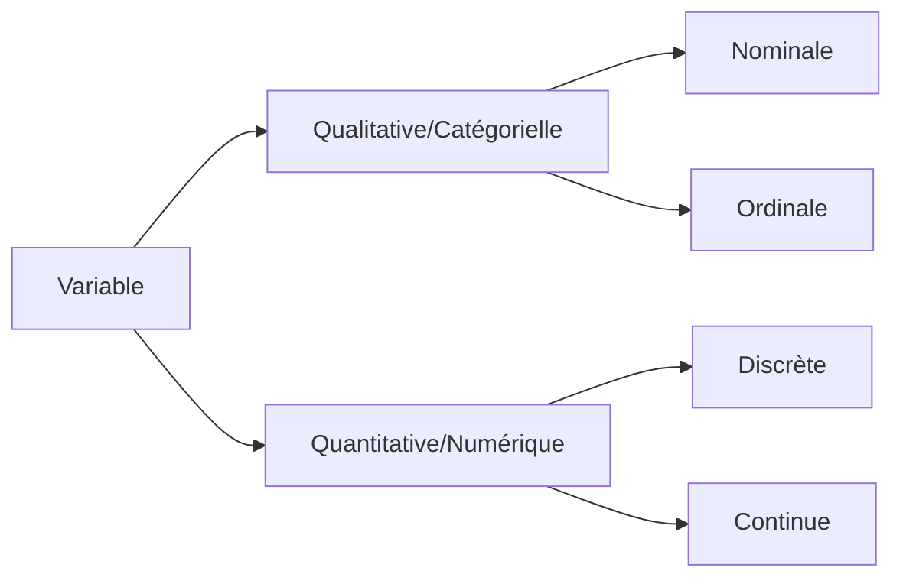

Ces dernières années nous avons vu :
- Une augmentation du volume de données
- Ses données sont divisées en :
	- Données Structurées
	- Données Non Structurées
![[Pasted image 20251202143510.png]]
Les influences majeures (depuis 1966) sur l'analyse de données :
- La théorie statistique
- L'accélération du développement informatique
- Le volume de données croissant
- La quantification devenant un point majeur de beaucoup de disciplines

## Data Analyse vs Data Ingénierie vs Data Science
![[Pasted image 20251202144240.png]]

## Le parcours data classique 
![[Pasted image 20251202144349.png]]

## Variable, Individu, Echantillon et Population
![[Pasted image 20251202145408.png]]

## Variable

## Apprentissage Supervisé vs Non Supervisé
### Apprentissage supervisé :
 On infère (prédit) une fonction ou une relation à partir de données d'apprentissage labellisées.
 On distingue :
- La **régression** : Pour un label **quantitatif**
- La **classification supervisée** : Pour un label **qualitatif**
![[Pasted image 20251202161320.png]]
### Apprentissage non-supervisé :
On trouve une structure dans des données non labellisées, comme :
- Le clustering
- Dimension Reduction
- ...
Plus "subjectif" que l'apprentissage supervisé, il peut servir d'étape de pré-traitement pour un apprentissage supervisé.![[Pasted image 20251202161345.png]]

## Cartographie des apprentissages
![[Pasted image 20251202161422.png]]
